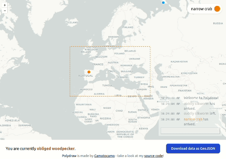

# polydraw

A collaborative online geo-data editing tool!



## How it works

* A backend application written in [NestJS](https://www.nestjs.com/)
* A frontend application written in [Vue](https://vuejs.org)
* Each user has a session opened in the backend, and each of their action is broadcast 
  and synchronized in a central state
* All users see (approximately) the same thing and can edit objects concurrently!

## Instructions

To start the application:

```shell
$ npm install
$ npm run start
```

And then open http://localhost:3000.

### Using Docker

To build image:

```shell
$ docker build -t camptocamp/polydraw .
```

Note: the app will be accessible on the 8080 port.

To run it:

```shell
$ docker run --init --rm -p 8080:8080 camptocamp/polydraw:latest
```

> Do not forget the `--init` argument, otherwise the docker image will not respond to SIGINT/SIGTERM

## Reference

As you may have noticed, this is super similar to https://www.placemark.io/, albeit vastly less powerful. At least it's open source ¯\\\_(ツ)_/¯
